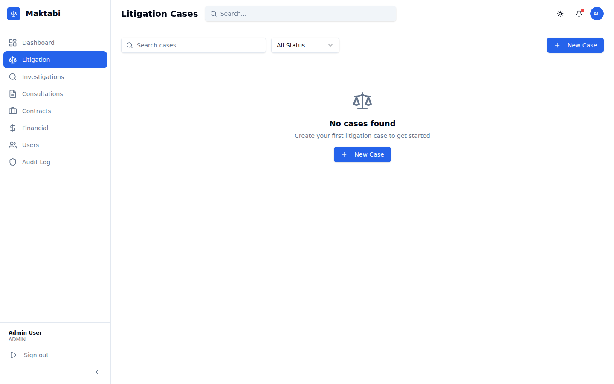
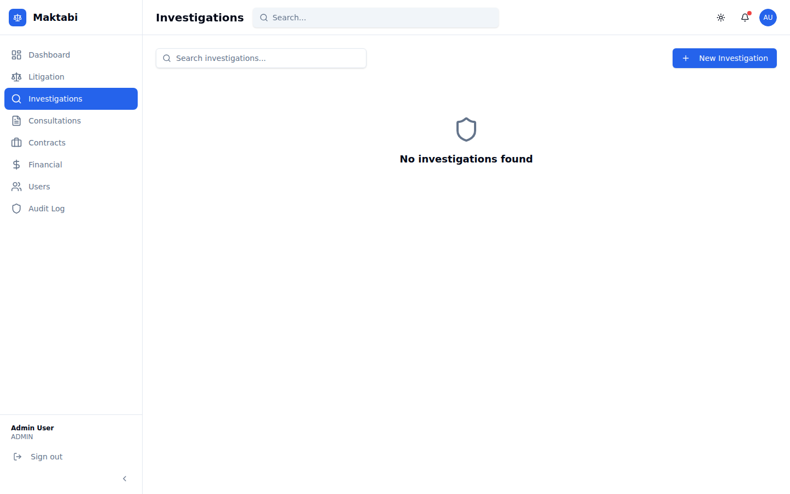
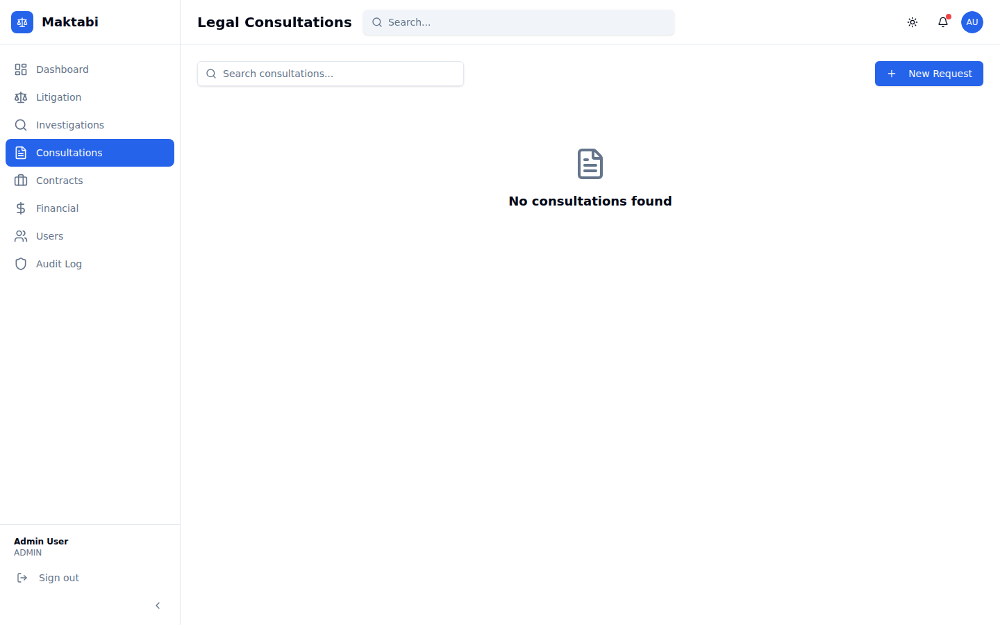
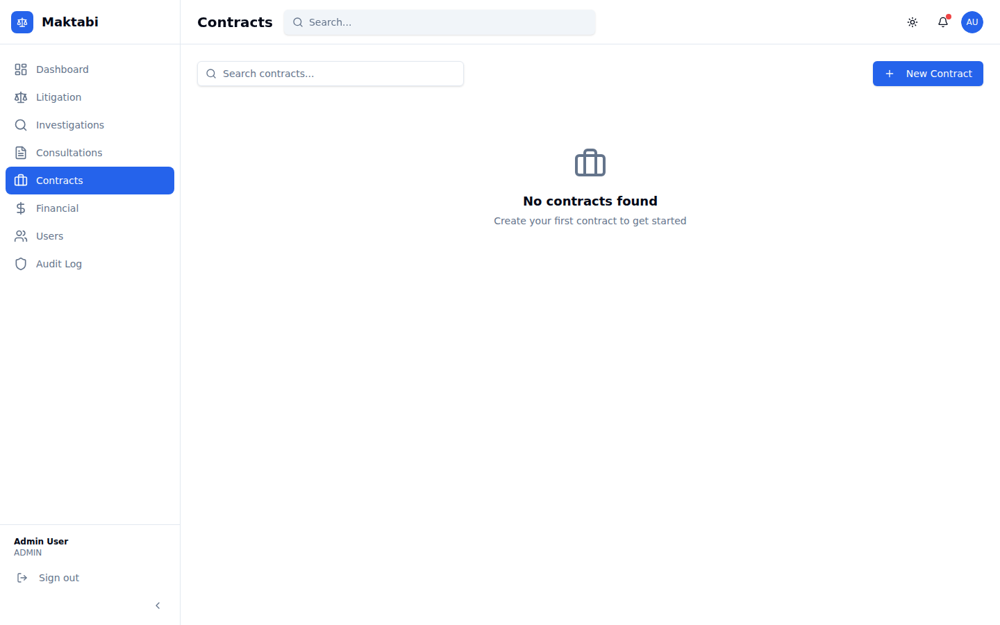
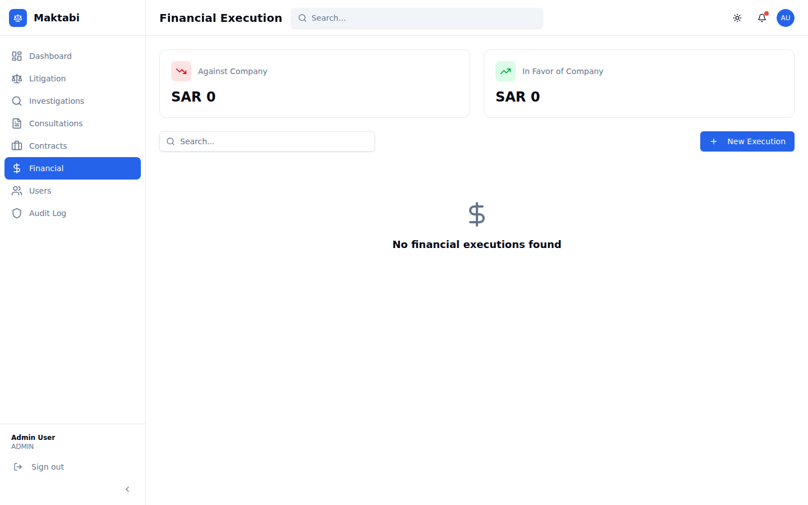
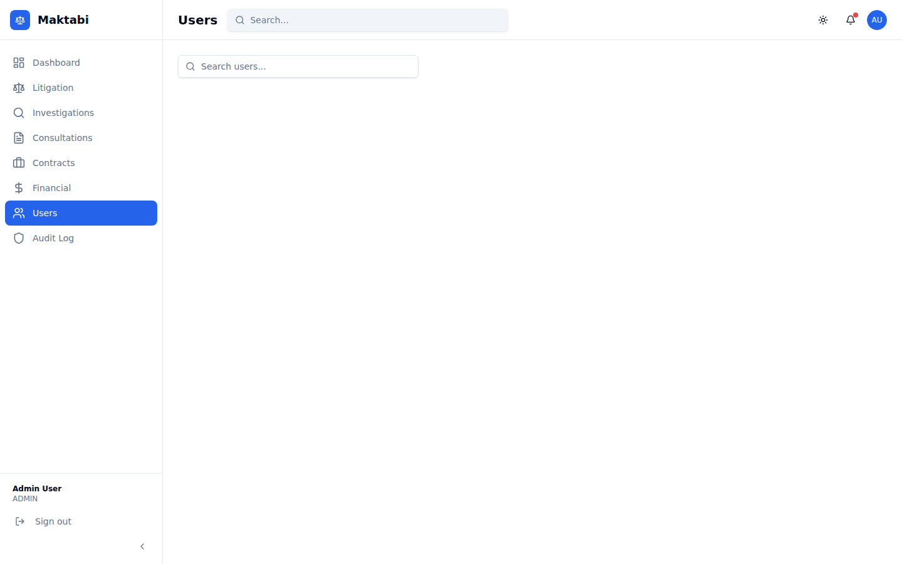
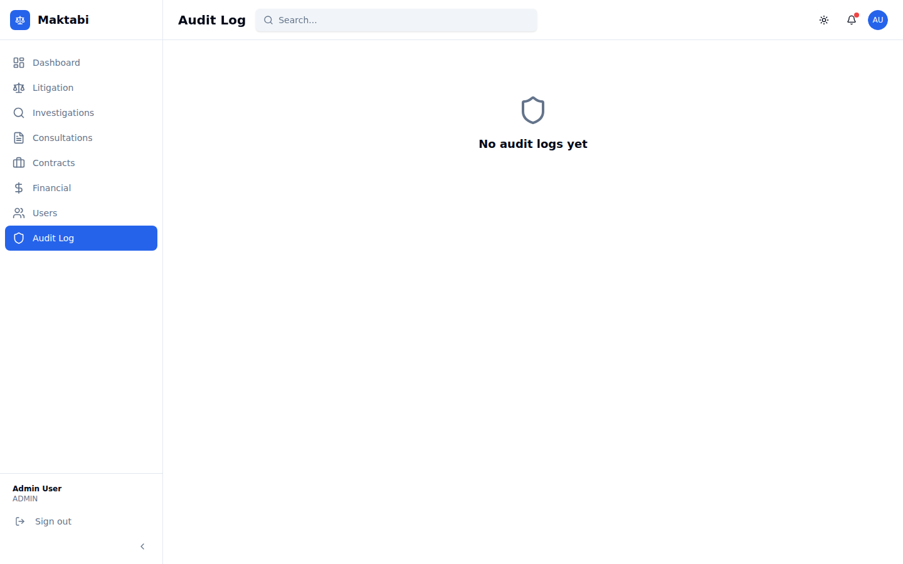

# Maktabi — Enterprise Legal Workflow Automation System

A production-ready Enterprise Legal Management & Workflow Automation Platform built with Next.js, NestJS, PostgreSQL, and Prisma.

## 🏗 Architecture

```
maktabi/
├── frontend/          # Next.js 14 (App Router) + TypeScript + TailwindCSS + shadcn/ui
├── backend/           # NestJS + TypeScript + Prisma + PostgreSQL
└── docker-compose.yml # Full stack Docker orchestration
```

## ✨ Features

### Core Modules
| Module | Description |
|--------|-------------|
| **Litigation** | Case management, hearing tracking, lawyer assignment, risk scoring |
| **Investigations** | HR disciplinary workflow, severity classification, confidentiality |
| **Consultations** | Legal opinion requests, SLA tracking, knowledge tagging |
| **Contracts** | Contract lifecycle, expiry alerts, value tracking, multi-step approvals |
| **Financial** | Execution tracking, payment recording, progress monitoring |

### System Features
- 🔐 JWT authentication with Role-Based Access Control (9 roles)
- 📊 Role-based dashboards with KPI cards and charts
- 📋 Configurable workflow engine with audit logging
- 🌙 Full light/dark mode support
- 📱 Responsive design
- 🔍 Global search & advanced filtering
- 📄 Swagger API documentation

### Roles
`ADMIN` · `CEO` · `LEGAL_MANAGER` · `INTERNAL_LAWYER` · `EXTERNAL_LAWYER` · `HR` · `FINANCE` · `DEPARTMENT_MANAGER` · `EMPLOYEE`

## 🚀 Quick Start

### Option 1: Docker Compose (Recommended)

> **No PostgreSQL installation required.** Docker bundles everything — database, backend, and frontend.

```bash
docker-compose up -d
```

Then open:
- Frontend: http://localhost:3000
- Backend API: http://localhost:3001
- Swagger Docs: http://localhost:3001/api/docs

### Option 2: DB in Docker + local backend & frontend

Use this option if you want to run the backend and frontend directly with Node.js (e.g. for hot-reload development) but **do not have PostgreSQL installed** on your machine.

#### Prerequisites
- Node.js 20+
- Docker Desktop

#### 1. Start only the PostgreSQL container

```bash
docker-compose -f docker-compose.db-only.yml up -d
```

This starts PostgreSQL on `localhost:5432` with the credentials already set in `backend/.env.example`. No further database configuration is needed.

#### 2. Backend

**Linux / macOS**

```bash
cd backend
cp .env.example .env
npm install
npx prisma generate
npx prisma migrate deploy
npx ts-node prisma/seed.ts
npm run start:dev
```

**Windows (Command Prompt)**

```cmd
cd backend
copy .env.example .env
npm install
npx prisma generate
npx prisma migrate deploy
npx ts-node prisma/seed.ts
npm run start:dev
```

**Windows (PowerShell)**

```powershell
cd backend
Copy-Item .env.example .env
npm install
npx prisma generate
npx prisma migrate deploy
npx ts-node prisma/seed.ts
npm run start:dev
```

#### 3. Frontend

**Linux / macOS**

```bash
cd frontend
cp .env.example .env.local
npm install
npm run dev
```

**Windows (Command Prompt)**

```cmd
cd frontend
copy .env.example .env.local
npm install
npm run dev
```

**Windows (PowerShell)**

```powershell
cd frontend
Copy-Item .env.example .env.local
npm install
npm run dev
```

### Option 3: Manual Setup (PostgreSQL installed locally)

#### Prerequisites
- Node.js 20+
- PostgreSQL 15+ (**not** MySQL/MariaDB — this project requires PostgreSQL)

> **Windows / XAMPP users:** XAMPP ships with MySQL/MariaDB, **not** PostgreSQL.
> You must install PostgreSQL separately.  Download the Windows installer from
> <https://www.postgresql.org/download/windows/> and run it.  During
> installation, note the password you set for the built-in `postgres` superuser
> — you will need it in the next step.

#### 1. Create the PostgreSQL database and user

**Linux / macOS**

```bash
psql -U postgres
```

**Windows** (open "SQL Shell (psql)" from the Start menu, or run from Command Prompt / PowerShell):

```cmd
psql -U postgres -h localhost
```

Once connected, run:

```sql
CREATE USER maktabi WITH PASSWORD 'maktabi123';
CREATE DATABASE maktabi_db OWNER maktabi;
GRANT ALL PRIVILEGES ON DATABASE maktabi_db TO maktabi;
\q
```

> **pgAdmin alternative:** If you prefer a GUI, open pgAdmin, connect to your
> local server, open the *Query Tool*, and paste the three SQL statements above
> (`\q` is a psql command to quit and is not needed in pgAdmin).

> **Note:** If you choose a different username or password, update
> `DATABASE_URL` in `backend/.env` accordingly.

#### 2. Backend

**Linux / macOS**

```bash
cd backend
cp .env.example .env
# Edit .env if you used different PostgreSQL credentials above
npm install
npx prisma generate
npx prisma migrate deploy
npx ts-node prisma/seed.ts
npm run start:dev
```

**Windows (Command Prompt)**

```cmd
cd backend
copy .env.example .env
rem Edit .env if you used different PostgreSQL credentials above
npm install
npx prisma generate
npx prisma migrate deploy
npx ts-node prisma/seed.ts
npm run start:dev
```

**Windows (PowerShell)**

```powershell
cd backend
Copy-Item .env.example .env
# Edit .env if you used different PostgreSQL credentials above
npm install
npx prisma generate
npx prisma migrate deploy
npx ts-node prisma/seed.ts
npm run start:dev
```

#### 3. Frontend

**Linux / macOS**

```bash
cd frontend
cp .env.example .env.local
# Edit .env.local if the backend runs on a different host/port
npm install
npm run dev
```

**Windows (Command Prompt)**

```cmd
cd frontend
copy .env.example .env.local
rem Edit .env.local if the backend runs on a different host/port
npm install
npm run dev
```

**Windows (PowerShell)**

```powershell
cd frontend
Copy-Item .env.example .env.local
# Edit .env.local if the backend runs on a different host/port
npm install
npm run dev
```

## 🔑 Demo Accounts

| Email | Password | Role |
|-------|----------|------|
| admin@maktabi.com | Admin@123 | Admin |
| ceo@maktabi.com | Ceo@123 | CEO |
| legal.manager@maktabi.com | Legal@123 | Legal Manager |
| lawyer@maktabi.com | Lawyer@123 | Internal Lawyer |
| hr@maktabi.com | Hr@123 | HR |
| finance@maktabi.com | Finance@123 | Finance |
| employee@maktabi.com | Employee@123 | Employee |

## 📚 API Documentation

Swagger UI is available at: `http://localhost:3001/api/docs`

### Key Endpoints
```
POST   /auth/login                    Login
GET    /dashboard/stats               Dashboard KPIs
GET    /litigation                    List cases
POST   /litigation                    Create case
PUT    /litigation/:id/status         Update case status
POST   /litigation/:id/hearings       Add hearing
GET    /contracts                     List contracts
GET    /contracts/expiring            Expiring contracts
GET    /investigations                List investigations
GET    /consultations                 List consultations
GET    /financial                     Financial executions
POST   /financial/:id/payments        Record payment
GET    /notifications                 User notifications
GET    /audit                         Audit logs (Admin/CEO)
GET    /users                         User directory
```

## 📸 Screenshots

### Login Page


The login screen features the Maktabi branding, email/password fields, and quick-access demo account buttons.

### Dashboard


The role-based dashboard shows KPI cards (Total Cases, Active Cases, Contracts, Pending Consultations), Financial Exposure summary, and Risk Distribution chart.

### Litigation Cases


Browse, search, and filter all litigation cases. The top-right **+ New Case** button opens the case creation form.

### New Litigation Case Form


Multi-field form to register a new litigation case with case number, type, court, assigned lawyer, risk level, and more.

### Investigations


HR disciplinary investigation tracker with severity classification and confidentiality controls.

### Consultations


Legal opinion request management with SLA tracking and knowledge tagging.

### Contracts


Full contract lifecycle management — view active contracts, expiry alerts, and multi-step approval status.

### Financial Executions


Track financial execution orders, record payments, and monitor payment progress.

### User Directory


Admin view of all platform users with their roles and contact details.

### Audit Log


Chronological audit trail of all system actions, accessible to Admin and CEO roles.

---

## 🗄 Database Schema

Key entities: `User`, `LitigationCase`, `Hearing`, `Investigation`, `Consultation`, `Contract`, `FinancialExecution`, `Payment`, `Document`, `WorkflowState`, `ApprovalLog`, `AuditLog`, `Notification`

## 🛠 Tech Stack

**Frontend**: Next.js 14 · TypeScript · TailwindCSS · shadcn/ui · Recharts · Framer Motion · React Hook Form + Zod · Zustand

**Backend**: NestJS · TypeScript · Prisma ORM · PostgreSQL · JWT · Passport · Swagger

**DevOps**: Docker · Docker Compose